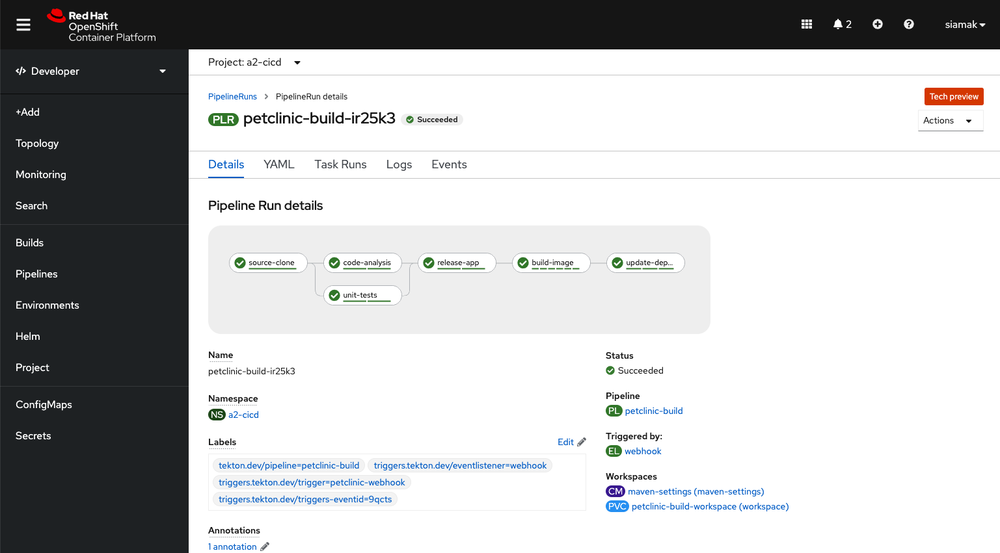
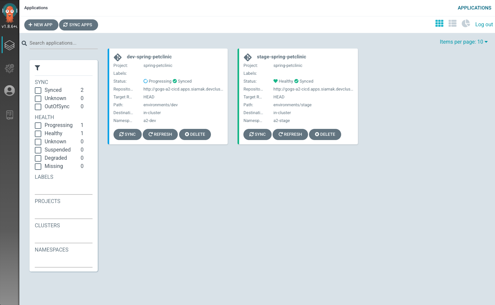

# CI/CD Demo with Tekton and Argo CD

This repo is a CI/CD demo using [Tekton Pipelines](http://www.tekton.dev) for continuous integration and [Argo CD](https://argoproj.github.io/argo-cd/) for continuous delivery on OpenShift which builds and deploys the [Spring PetClinic](https://github.com/spring-projects/spring-petclinic) sample Spring Boot application. This demo creates:
* 3 namespaces for CI/CD, DEV and STAGE projects
* 1 Tekton pipeline for building the application image on every Git commit 
* Argo CD (username/password: `admin`/[_retrieve from the cluster_])
* Gogs git server (username/password: `gogs`/`gogs`)
* Sonatype Nexus (username/password: `admin`/`admin123`)
* SonarQube (username/password: `admin`/`admin`)
* Git webhooks for triggering the CI pipeline

<p align="center">
  
</p>

## CI Pipeline

On every push to the `spring-petclinic` git repository on Gogs git server, the following steps are executed within the Tekton pipeline:

1. Code is cloned from Gogs git server and the unit-tests are run
1. Unit tests are executed and in parallel the code is analyzed by SonarQube for anti-patterns, and a dependency report is generated
1. Application is packaged as a JAR and released to Sonatype Nexus snapshot repository
1. A container image is built in DEV environment using S2I, and pushed to OpenShift internal registry, and tagged with `spring-petclinic:[branch]-[commit-sha]` and `spring-petclinic:latest`
1. Kubernetes manifests are updated in the Git repository with the image digest that was built within the pipeline


## Continuous Delivery

Argo CD continuously monitor the configurations stored in the Git repository and uses [Kustomize](https://kustomize.io/) to overlay environment specific configurations when deploying the application to DEV and STAGE environments.


# Deploy
1. Get an OpenShift cluster via https://try.openshift.com
1. Install OpenShift GitOps Operator 
1. Download [OpenShift CLI](https://mirror.openshift.com/pub/openshift-v4/clients/ocp/latest/) and [Tekton CLI](https://github.com/tektoncd/cli/releases)
1. Deploy the demo

    ```
    $ oc new-project demo
    $ git clone https://github.com/siamaksade/tekton-cd-demo
    $ demo.sh install
    ```

1. Start the deploy pipeline by making a change in the `spring-petclinic` Git repository on Gogs, or run the following:

    ```
    $ demo.sh start
    ```

1. Check pipeline run logs

    ```
    $ tkn pipeline logs petclinic-deploy-dev -n NAMESPACE
    ```






# Troubleshooting

## Why am I getting `unable to recognize "tasks/task.yaml": no matches for kind "Task" in version "tekton.dev/v1beta1"` errors?

You might have just installed the OpenShift Pipelines operator on the cluster and the operator has not finished installing Tekton on the cluster yet. Wait a few minutes for the operator to finish and then install the demo.
